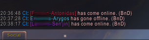

# CommunityInfo (WoW AddOn)

&nbsp; &nbsp; &nbsp; &nbsp;

## Description
When the communities appeared, i missed community member notifcations like with the guilds (online, offline, join and leave).
This addon is my answer.

## Contains

* Online, offline, join and leave Notification in chat window. (You can choose target like: Default Chat or other chat windows)
  * (Optional) Include/Exclude single members
  * (Optional) Display member notes behind the notification.

* Separate broker module + tooltip for any wow community
  * Broker module can be displayed on panels like Titan Panel or Bazooka
  * Alternatively you can enable a minimap button (option per community)
  * (Optional) Show/Hide community message of the day in tooltip
  * (Optional) Show/Hide community description

*  Option panel
  * (Optional) Sound notification for members who came online.
  * (Optional) Screen capture mode - It replace some text by asterisk like password fields in websites. (see picture above)\
If the community internals does not want to appear in the stream.

## Bug reports, feature requests and Support
* [Bug reports & feature requests on Github](https://github.com/HizurosWoWAddOns/CommunityInfo/issues)
* [Comments & Criticism on Curseforge](https://www.curseforge.com/wow/addons/communityinfo)

## Localization
Do you want to help translate this addon?
See [Curseforge localization tool](https://www.curseforge.com/wow/addons/communityinfo/localization)

## Hizuro's projects
* On [Curseforge](https://www.curseforge.com/members/hizuro_de/projects)
* On [Github](https://github.com/HizurosWoWAddOns)

## Disclaimer
> World of Warcraft© and Blizzard Entertainment© are all trademarks or registered trademarks of Blizzard Entertainment in the United States and/or other countries. These terms and all related materials, logos, and images are copyright © Blizzard Entertainment.
